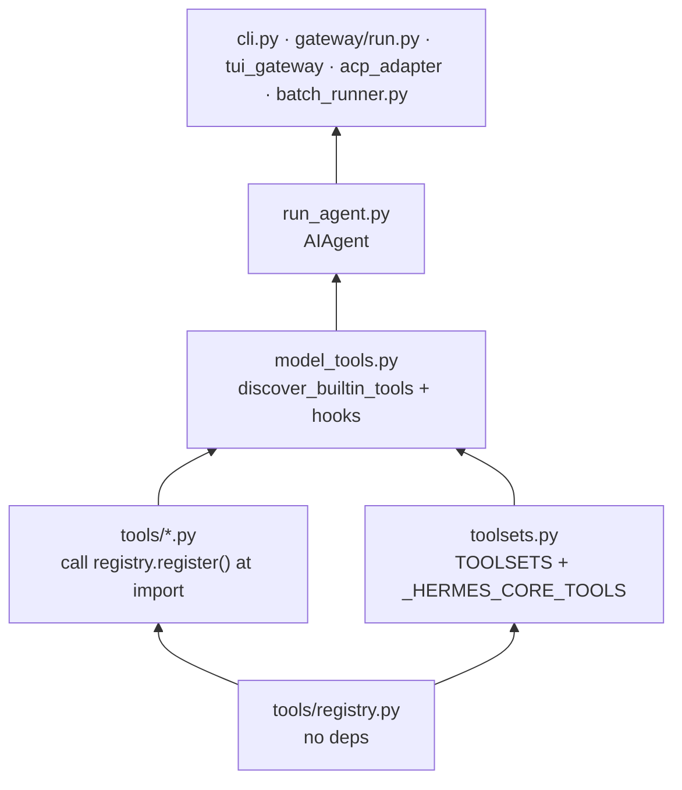
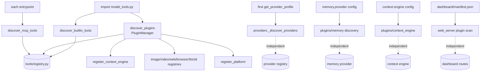
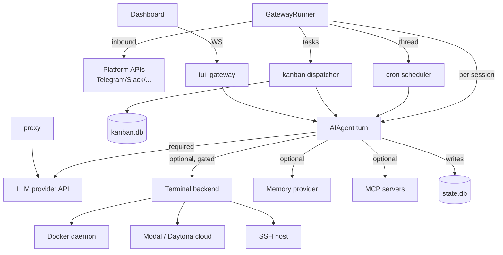
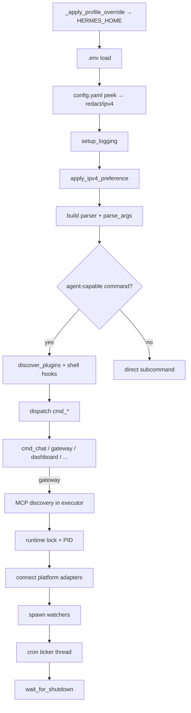

# Hermes — Dependency Graph

Internal module dependencies, external service dependencies, language
package dependencies, and startup-order relationships.

> Analysis only. Two dependency kinds are tracked: **build/import-time**
> (who imports whom) and **runtime** (who needs whom alive to function).

---

## 1. Internal module dependency chain (import-time)

The canonical chain from `AGENTS.md`, verified against the code:



Key facts:
- `tools/registry.py` imports nothing from Hermes — it is the root.
- Importing `model_tools.py` triggers **two** side-effect discoveries:
  `discover_builtin_tools()` (imports every self-registering `tools/*.py`)
  and `hermes_cli.plugins.discover_plugins()`.
- MCP discovery is **not** triggered by import — each entrypoint calls
  `discover_mcp_tools()` itself (gateway in an executor, CLI inline, ACP via
  `to_thread`) so a slow MCP server can't freeze startup.
- `providers/` uses **lazy** discovery on first `get_provider_profile()` /
  `list_providers()`, independent of the `PluginManager`.

---

## 2. The parallel discovery systems (who bypasses whom)



The `PluginManager` records manifests for `exclusive` (memory) and
`model-provider` kinds but does **not** import them — their category systems
own loading, preventing double-registration.

---

## 3. Runtime dependency graph (who must be alive)



**Hard runtime dependency:** an LLM provider endpoint. Everything else is
gated by `check_fn` and degrades gracefully (the tool simply doesn't appear).

---

## 4. Failure propagation (dependency direction = failure direction)

| If this fails… | …then | Mitigation |
|---|---|---|
| LLM provider (down / 429 / bad key) | agent turn errors | `fallback_model`, `credential_pool` rotation, `nous_rate_guard` breaker, sanitized error reply — process stays alive |
| Auxiliary provider unhealthy | side-tasks (compression/vision/title) reroute | `_resolve_auto` chain (OpenRouter → Nous → custom → API-key), 10-min unhealthy TTL |
| Platform token invalid | that adapter only | `_failed_platforms` + `_platform_reconnect_watcher` (30s backoff); zero connected → `startup_failed` |
| Docker daemon down | terminal `docker` backend hidden | `check_terminal_requirements` gates it; `check_fn` TTL cache 30s |
| MCP server down | its tools hidden | discovery timeout (120s), gateway continues |
| `state.db` locked (NFS) | `/resume`/search degrade | WARNING logged, gateway runs |
| Prompt-cache broken (mid-conversation mutation) | cost multiplies (not a crash) | policy: no toolset/system-prompt mutation except compression |
| Cron job hangs | that job only | 600s inactivity interrupt; `.tick.lock` prevents overlap |
| Two gateways share a token | credential conflict | per-identity scoped locks (`gateway/status.py`) |

---

## 5. Python dependencies (`pyproject.toml`)

Package `hermes-agent` 0.16.0, `requires-python >=3.11,<3.14`. **All deps
carry upper bounds** (supply-chain policy after the litellm compromise and
Mini Shai-Hulud worm — see `AGENTS.md`).

**Core (always installed, exact-pinned examples):** `openai==2.24.0`,
`pydantic==2.13.4`, `httpx[socks]`, `rich`, `prompt_toolkit`, `fastapi`,
`uvicorn[standard]`, `croniter`, `PyJWT[crypto]`, `psutil`, `websockets`,
`ptyprocess`/`pywinpty`, `Pillow`, `fire`, `tenacity`, `pyyaml`,
`ruamel.yaml`, `jinja2`, `requests`, `certifi`, `python-dotenv`.

**Notable optional extras:**

| Extra | Purpose | Key packages |
|---|---|---|
| `messaging` | messaging gateway | python-telegram-bot[webhooks], discord.py[voice], slack-bolt, aiohttp, qrcode |
| `matrix` | Matrix + E2EE | mautrix[encryption], aiosqlite, asyncpg |
| `mcp` | MCP client/server | mcp==1.26.0, starlette==1.0.1 |
| `web` | dashboard | fastapi==0.133.1, uvicorn[standard] |
| `acp` | editor integration | agent-client-protocol |
| `voice` | STT | faster-whisper, sounddevice, numpy |
| `anthropic` | Claude native | anthropic==0.87.0 |
| `modal` / `daytona` / `bedrock` | cloud backends | modal / daytona / boto3 |
| `honcho` / `hindsight` | memory providers | honcho-ai / hindsight-client |
| `all` | umbrella | `[cron,cli,pty,mcp,homeassistant,sms,acp,google,web,youtube]` — **excludes** provider/search/TTS/messaging/matrix/voice (those lazy-install via `tools/lazy_deps.py`) |

Lockfile: `uv.lock`. Dependency pinning matrix (from `AGENTS.md`): PyPI
`>=floor,<next_major`; git URL → commit SHA; GitHub Action → SHA + comment.

---

## 6. JavaScript / TypeScript dependencies

Root `package.json` — npm workspaces `apps/*`, `ui-tui`, `ui-tui/packages/*`,
`web` (Node ≥ 20). `website/` and `apps/bootstrap-installer/` are standalone
(own lockfiles). Lockfile: `package-lock.json`.

```mermaid
flowchart TD
    ROOT[root package.json<br/>workspaces]
    ROOT --> UITUI[ui-tui<br/>ink@6 react@19 nanostores undici]
    UITUI --> HINK[packages/hermes-ink<br/>@hermes/ink vendored renderer]
    ROOT --> DESK[apps/desktop<br/>electron@40 assistant-ui xterm node-pty]
    ROOT --> WEBW[web<br/>react@19 vite tailwind xterm three plot]
    ROOT --> SHARED[apps/shared<br/>@hermes/shared JsonRpcGatewayClient]
    DESK --> SHARED
    WEBSITE[website<br/>docusaurus 3.9 · standalone]
    BOOT[apps/bootstrap-installer<br/>Tauri 2 · standalone]

    WEBW -->|build → | WDIST[hermes_cli/web_dist/<br/>Python package-data]
```

`apps/shared/src/json-rpc-gateway.ts` is the canonical browser JSON-RPC
client; desktop extends it, `web` and `ui-tui` have parallel implementations
of the same wire protocol.

---

## 7. External service dependencies (by capability + env key)

| Capability | Providers (examples) | Credential env |
|---|---|---|
| Chat inference | Nous, OpenRouter, Anthropic, OpenAI-Codex, Gemini, xAI, DeepSeek, GLM/Z.AI, Kimi, MiniMax, NVIDIA, HuggingFace, Bedrock, Azure… (28 profiles) | `*_API_KEY` / OAuth (`auth.json`) |
| Web search/extract | Exa, Firecrawl, Parallel, Tavily, Brave, SearXNG, xAI | `EXA_API_KEY`, `FIRECRAWL_API_KEY`, … |
| Cloud browser | Browser Use, Browserbase, Firecrawl | `BROWSER_USE_API_KEY`, `BROWSERBASE_*` |
| Image / video gen | FAL, Krea, OpenAI, xAI | `FAL_KEY`, `KREA_API_KEY` |
| TTS | Edge, ElevenLabs, OpenAI, Gemini, xAI, Mistral | `ELEVENLABS_API_KEY`, … |
| STT | local Whisper, Groq, OpenAI, Mistral, xAI | provider keys |
| Memory | Honcho, Mem0, Supermemory, Hindsight, RetainDB, OpenViking | `HONCHO_API_KEY`, `RETAINDB_API_KEY`, … |
| Terminal cloud | Modal, Daytona | SDK creds |
| Secrets | Bitwarden Secrets Manager | `BWS_ACCESS_TOKEN` |
| Messaging | ~20 platforms | see per-platform tokens in `SERVICE_RELATIONSHIPS.md` |
| Tool Gateway | Nous Portal (search/image/TTS/browser under one sub) | `TOOL_GATEWAY_USER_TOKEN` |

Non-secret behavioral config lives in `config.yaml`; `.env` holds
**secrets only** (`OPTIONAL_ENV_VARS` in `hermes_cli/config.py`).

---

## 8. Startup-order dependency (initialization sequence)



The ordering constraints that matter:
1. `HERMES_HOME` must be set **before any module imports** (module-level
   constants cache `get_hermes_home()` at import time).
2. `HERMES_REDACT_SECRETS` must be bridged **before** `agent.redact` snapshots
   it.
3. IPv4 preference must be applied **before** any HTTP client is built.
4. Tool discovery happens at `model_tools` import; toolset wiring is separate
   and deliberate (a registered tool is invisible until it's in a toolset).
