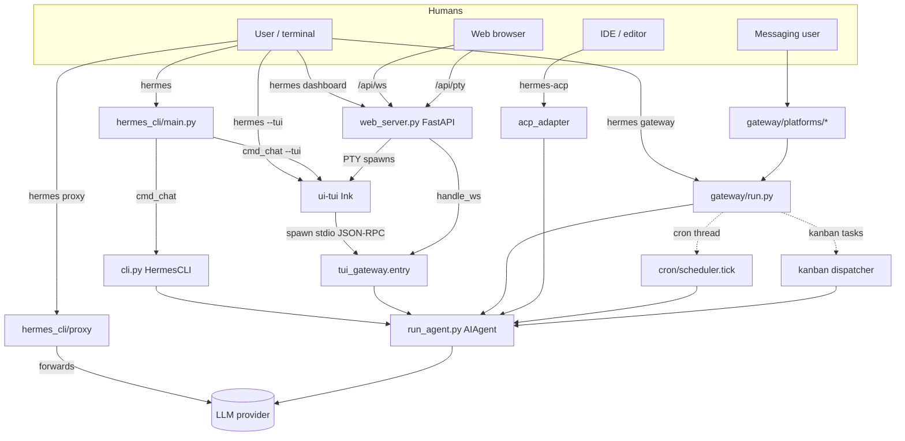

# Hermes — Entry Points

Every way execution enters the Hermes system: console scripts, `hermes`
subcommands, direct-run scripts, RPC/HTTP servers, messaging ingress,
scheduled entries, UI launch chains, and container entrypoints.

> Analysis only. Paths are relative to the repository root unless noted.
> Package version `0.16.0`.

---

## 1. Console scripts (installed commands)

Declared in `pyproject.toml` `[project.scripts]` (lines 277–280).

| Command | Target | File | Launches |
|---|---|---|---|
| `hermes` | `hermes_cli.main:main` | `hermes_cli/main.py` (~12.5k LOC) | The primary multi-subcommand CLI — dispatches everything below |
| `hermes-agent` | `run_agent:main` | `run_agent.py` (~5.4k LOC) | Standalone tool-calling agent loop (Fire CLI) |
| `hermes-acp` | `acp_adapter.entry:main` | `acp_adapter/entry.py` | ACP stdio server for editor integration (Zed/VS Code/JetBrains) |

Auxiliary launchers that reach the same code:
- `./hermes` — repo-root wrapper (`from hermes_cli.main import main; main()`)
- `python -m acp_adapter` — `acp_adapter/__main__.py` → `entry.main`
- `python -m gateway.run` — `gateway/run.py:main()` (line 16762) → `asyncio.run(start_gateway(config))`
- `python -m tui_gateway.entry` — TUI JSON-RPC backend (spawned by the Ink TUI)

---

## 2. `hermes <subcommand>` — the CLI surface

Parser tree built in `hermes_cli/_parser.py:build_top_level_parser()`; the 36
subcommand parser-builders live in `hermes_cli/subcommands/` while their
`cmd_*` handlers stay in `main.py` (dependency-injected to avoid an import
cycle). Authoritative set: `_BUILTIN_SUBCOMMANDS` (main.py 10954–10971).

**Agent / chat**: `chat` (default), `acp`, `computer-use`
**Model & routing**: `model`, `fallback`, `portal`, `proxy`
**Messaging**: `gateway`, `slack`, `whatsapp`, `whatsapp-cloud`, `webhook`, `pairing`, `send`
**Scheduling & queues**: `cron`, `kanban`, `curator`
**Extensibility**: `tools`, `skills`, `plugins`, `mcp`, `hooks`, `lsp`, `bundles`
**State & sessions**: `sessions`, `checkpoints`, `insights`, `memory`, `backup`, `dump`
**Config & setup**: `config`, `setup`, `auth`, `login`, `logout`, `secrets`, `profile`, `security`
**UI**: `dashboard`, `gui`/`desktop`
**Lifecycle & ops**: `doctor`, `status`, `logs`, `version`, `update`, `uninstall`, `postinstall`, `prompt-size`, `debug`, `completion`
**Migration**: `migrate`, `claw`, `import`

Selected handler → implementation module:

| Subcommand | Implementation |
|---|---|
| `chat` (default) | `cli.py:main()` (classic REPL) or `_launch_tui()` (Ink TUI) |
| `gateway` | `hermes_cli/gateway.py:gateway_command` → `gateway/run.py:start_gateway` |
| `dashboard` | `hermes_cli/web_server.py` (FastAPI + uvicorn) |
| `cron` | `hermes_cli/cron.py` → `cron/scheduler.py` (one-shot tick) |
| `kanban` | `hermes_cli/kanban.py` + `hermes_cli/kanban_db.py` |
| `mcp` | `hermes_cli/mcp_config.py`; `mcp serve` → `mcp_serve.py:run_mcp_server` |
| `proxy` | `hermes_cli/proxy/` (OpenAI-compatible OAuth forwarder, port 8645) |
| `model` | `hermes_cli/model_switch.py`, `hermes_cli/models.py` |
| `curator` | `hermes_cli/curator.py` → `agent/curator.py` |
| `acp` | `acp_adapter/entry.py` |
| `sessions` | `hermes_cli/session_listing.py` + `hermes_state.py` |

Plugin-contributed subcommands (`hermes <plugin> <subcmd>`) are wired in
dynamically (main.py ~11803) only when the first token is not a builtin.

---

## 3. Direct-run scripts (repo root)

All import `hermes_bootstrap` first (Windows UTF-8 stdio; no-op on POSIX).

| Script | Entry | Launches |
|---|---|---|
| `cli.py` | `fire.Fire(main)` @13984 | Classic `prompt_toolkit` REPL / single-query agent (`HermesCLI`) |
| `run_agent.py` | `fire.Fire(main)` @5245 | Standalone agent loop; core `AIAgent` class @320 |
| `batch_runner.py` | `fire.Fire(main)` @1147 | Parallel batch agent runs over a JSONL dataset (`multiprocessing.Pool`) |
| `mcp_serve.py` | `run_mcp_server` | stdio `FastMCP` server exposing messaging conversations as MCP tools |
| `mini_swe_runner.py` | `fire.Fire(main)` @636 | SWE-task runner over execution backends; emits Hermes trajectories |
| `trajectory_compressor.py` | `fire.Fire(main)` @1361 | Compress/analyze trajectory JSONL for training data |
| `toolset_distributions.py` | `__main__` @323 | Toolset probability distributions for datagen |
| `hermes_bootstrap.py` | import side-effect | Windows UTF-8 stdio bootstrap only |

---

## 4. Server / RPC / IPC entrypoints (long-lived listeners)

| Entrypoint | Transport | Bind / port | Started by |
|---|---|---|---|
| **Gateway runner** | messaging adapters | per-platform | `hermes gateway run` → `gateway/run.py:start_gateway` |
| **Dashboard web server** | HTTP + WebSocket | `127.0.0.1:9119` (default) | `hermes dashboard` → `hermes_cli/web_server.py` |
| **TUI gateway** | stdio JSON-RPC (or WS attach) | stdio / `/api/ws` | `python -m tui_gateway.entry` (spawned by Ink) |
| **ACP adapter** | stdio JSON-RPC | stdio | `hermes acp` / `hermes-acp` |
| **OpenAI-compatible proxy** | HTTP | `127.0.0.1:8645` | `hermes proxy start` |
| **API-server platform** | HTTP (OpenAI-compatible) | `127.0.0.1:8642` | gateway platform `api_server` |
| **Webhook platform** | HTTP ingress | `0.0.0.0:8644` | gateway platform `webhook` |
| **Hermes-as-MCP** | stdio (`FastMCP`) | stdio | `hermes mcp serve` → `mcp_serve.py` |

The dashboard's `/api/pty` WebSocket embeds a real `hermes --tui` behind a
PTY; `/api/ws` bridges to `tui_gateway.ws.handle_ws`; `/api/pub` mirrors
events to the sidebar.

---

## 5. Messaging ingress (inbound message → agent turn)

Every enabled platform adapter is an entry point for user messages. The
adapter's `set_message_handler(self._handle_message)` wires inbound events to
`gateway/run.py:_handle_message` → `_handle_message_with_agent` → `_run_agent`
→ a per-session `AIAgent`.

- **Polling**: Telegram (`getUpdates`), Email (IMAP), Weixin
- **WebSocket**: Slack (Socket Mode), Matrix (`/sync`), DingTalk, Feishu, WeCom, QQ, Yuanbao, Discord (plugin)
- **Webhook (HTTP ingress)**: WhatsApp Cloud, SMS (Twilio), WeCom callback, BlueBubbles (iMessage), MSGraph/Teams, `webhook` (generic, fans out to other platforms)
- **Subprocess bridge**: WhatsApp personal (Node.js `bridge.pid`)
- **SSE + JSON-RPC**: Signal (signal-cli REST)

`webhook.py` is special — inbound-only HTTP that *fans out to other
platforms* (routes `POST /webhooks/{route_name}`, HMAC-validated).

---

## 6. Scheduled / event-driven entries (no human at the keyboard)

| Trigger | Entry | Runs |
|---|---|---|
| **Cron tick** | `cron/scheduler.py:tick()` — daemon thread in the gateway (`_start_cron_ticker`, 60s) or `hermes cron tick` | Fresh `AIAgent` per due job |
| **Kanban dispatcher** | `gateway/kanban_watchers.py:_kanban_dispatcher_watcher` (or `hermes kanban daemon`) | Spawns worker profiles for ready tasks |
| **Curator** | `agent/curator.py:maybe_run_curator` — polled hourly by the cron ticker | Forked `AIAgent` for skill maintenance (internally gated to ~weekly) |
| **Background process watcher** | `gateway/run.py:_run_process_watcher` | Re-enters the agent when `terminal(background=True, notify_on_complete=True)` completes |
| **Async delegation watcher** | `_async_delegation_watcher` (2s) | Injects completed async-subagent results as new turns |
| **Handoff / session-expiry / reconnect watchers** | `_handoff_watcher`, `_session_expiry_watcher`, `_platform_reconnect_watcher` | Session lifecycle & platform recovery |

---

## 7. UI launch chains

**Ink TUI** (`hermes --tui`): `cmd_chat` → `_resolve_use_tui` → `_launch_tui`
→ `node ui-tui/dist/entry.js` → `ui-tui/src/gatewayClient.ts` spawns
`python -m tui_gateway.entry`. *(Python launches Node launches Python.)*

**Electron desktop** (`apps/desktop/`): `electron/main.cjs` spawns
`python -m hermes_cli.main dashboard --no-open --port 0`, then the renderer
connects to `ws://127.0.0.1:<port>/api/ws` (→ `tui_gateway.ws.handle_ws`).

**Web dashboard SPA** (`web/`): built into `hermes_cli/web_dist/`, served by
`web_server.py`; `ChatPage.tsx` embeds the TUI via the `/api/pty` PTY bridge.

**Bootstrap installer** (`apps/bootstrap-installer/`, Tauri): drives
`scripts/install.ps1` / `install.sh`.

---

## 8. Container / service entrypoints

| Entry | Mechanism |
|---|---|
| Docker `ENTRYPOINT` | `/init` (s6-overlay) → `docker/main-wrapper.sh` (CMD routing + privilege drop) |
| s6 services | `docker/s6-rc.d/main-hermes` (no-op), `dashboard` (gated on `HERMES_DASHBOARD`) |
| systemd unit | `ExecStart=<python> -m hermes_cli.main gateway run` (generated) |
| launchd plist | `ai.hermes.gateway[-<profile>]` → `gateway run --replace` (generated) |
| NixOS module | `systemd.services.hermes-agent` (native or container mode) |
| Homebrew | CLI install only (`hermes`, `hermes-agent`, `hermes-acp`) |

---

## 9. CLI startup order (what initializes, in order)

**Phase A — module import of `hermes_cli/main.py`** (before `main()`):
1. `_apply_profile_override()` (@508) — scan `-p/--profile`, set `HERMES_HOME`, strip the flag
2. `.env` load (`~/.hermes/.env` then project `.env`)
3. Early raw `config.yaml` peek — bridge `security.redact_secrets` → `HERMES_REDACT_SECRETS`, read `network.force_ipv4`
4. `setup_logging(mode=gui|cli)` — `agent.log` / `errors.log` / `gui.log`
5. `apply_ipv4_preference` (before any HTTP client)

**Phase B — `main()`** (@11433):
6. Process title, Windows stdio, interrupted-install recovery, Termux fast-paths
7. Build parser + all subparser builders
8. Container routing (`_exec_in_container` may replace the process)
9. `parser.parse_args`
10. `_prepare_agent_startup(args)` — plugin discovery + shell-hook registration, **only** for agent-capable commands (chat/acp/rl, `cron run/tick`, `gateway run`, `mcp serve`)
11. Dispatch `args.func(args)` (default `cmd_chat`)

**`cmd_chat` → session boot** (@2135): resolve TUI vs CLI → resolve
`--resume`/`--continue` via `hermes_state` → first-run provider guard →
bundled-skill sync → env flags → `_launch_tui()` **or** `cli.main()` (config
load, tool/toolset discovery, skin engine, `SessionDB` all happen inside
`HermesCLI`).

---

## 10. Entry-point fan-out (Mermaid)

