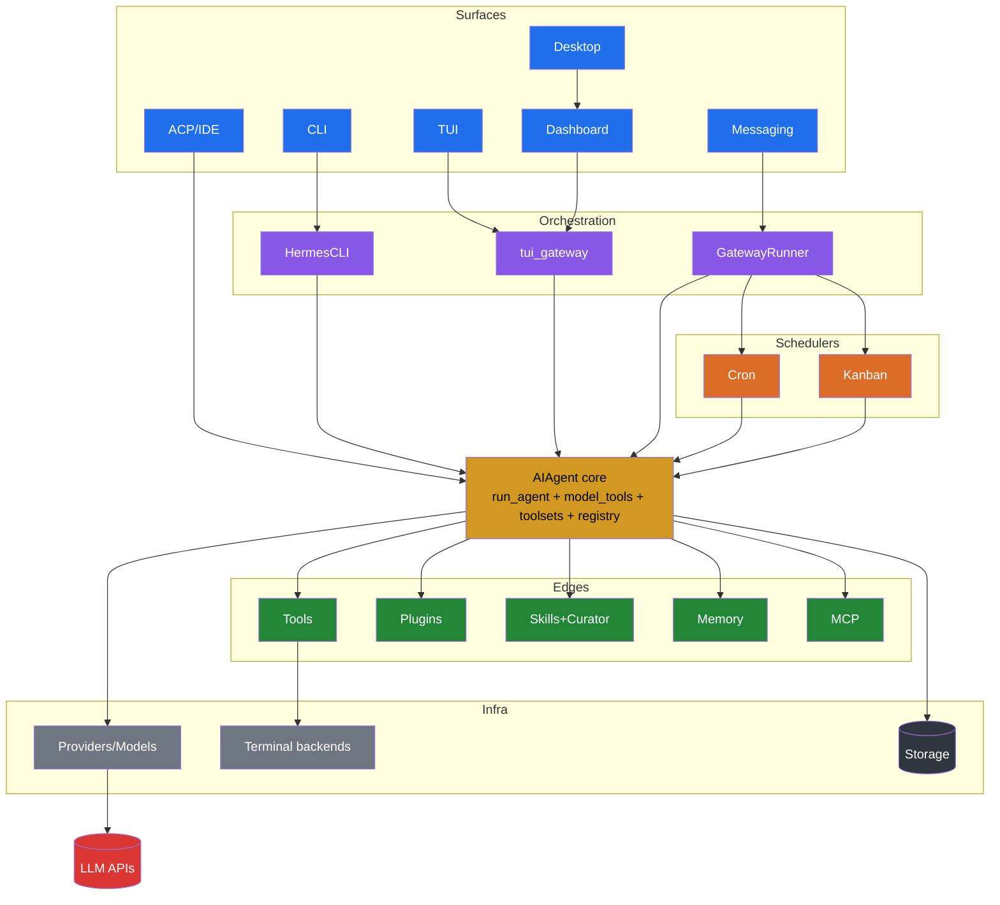
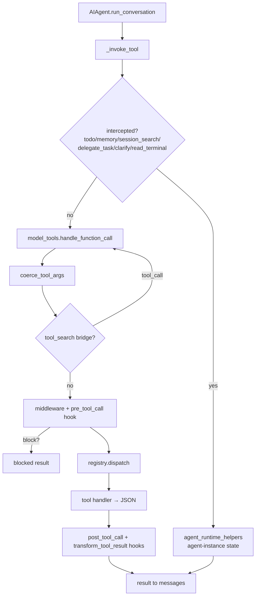
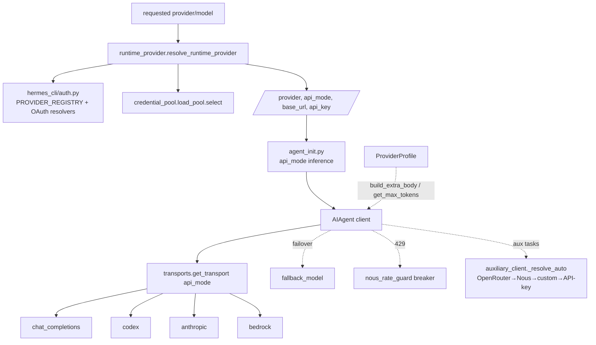

# Hermes — Knowledge Graph

The master knowledge graph of the Hermes agent: a typed catalog of every
subsystem, service, CLI, plugin, scheduler, service unit, configuration,
API, model, provider, and dependency — plus the relationships between them
(who calls whom, startup order, runtime dependencies, failure propagation,
ownership).

> **Analysis only — no implementation.** Companion documents:
> [`SYSTEM_MAP.md`](SYSTEM_MAP.md) (layered architecture),
> [`DEPENDENCY_GRAPH.md`](DEPENDENCY_GRAPH.md) (imports + deps),
> [`SERVICE_RELATIONSHIPS.md`](SERVICE_RELATIONSHIPS.md) (long-running
> services), [`ENTRY_POINTS.md`](ENTRY_POINTS.md) (execution entry points).
> Derived from a repository-wide sweep of `hermes-agent` @ `0.16.0`.

---

## 1. Node & edge taxonomy

**Node types**

| Type | Meaning | Examples |
|---|---|---|
| `Subsystem` | A cohesive functional area | agent core, gateway, cron, kanban, skills |
| `Service` | A process / long-lived loop | GatewayRunner, dashboard, cron ticker, curator |
| `EntryPoint` | A way execution enters | `hermes`, `hermes-acp`, `python -m gateway.run` |
| `CLI` | A `hermes <subcommand>` | `gateway`, `cron`, `model`, `tools` |
| `Plugin` | Runtime-discovered extension | memory/honcho, model-providers/nous, platforms/discord |
| `Scheduler` | Time/event-driven executor | cron scheduler, kanban dispatcher |
| `ServiceUnit` | OS supervision unit | systemd unit, launchd plist, s6 service |
| `Config` | A config surface | `config.yaml` section, `.env` var |
| `API` | An exposed interface | JSON-RPC method, REST route, MCP tool |
| `Model`/`Provider` | Inference backend / model catalog | Anthropic, OpenRouter, Nous, `claude-opus-4.6` |
| `Tool` | An agent model tool | `terminal`, `web_search`, `delegate_task` |
| `Storage` | Persistent state | `state.db`, `jobs.json`, `kanban.db`, `skills/` |
| `Dependency` | External package/service | `openai`, Docker daemon, platform APIs |

**Edge types**

`calls` · `spawns` · `imports` · `registers-into` · `reads-config` ·
`delivers-to` · `gated-by` · `stores-in` · `supervises` · `fails-to`
(failure propagation) · `starts-before` (startup order) · `owns`.

---

## 2. Master graph (high level)

---

## 3. Node catalog

### 3.1 Subsystems

| Subsystem | Root path | Purpose |
|---|---|---|
| Agent core | `run_agent.py`, `model_tools.py`, `toolsets.py`, `tools/registry.py` | Conversation loop, tool orchestration, dispatch |
| CLI | `cli.py`, `hermes_cli/` | Interactive REPL + all `hermes` subcommands |
| Messaging gateway | `gateway/` | ~20 platform adapters, per-session agents, watchers |
| TUI | `ui-tui/`, `tui_gateway/` | Ink client + Python JSON-RPC backend |
| Desktop | `apps/desktop/` | Electron chat app |
| Dashboard | `web/`, `hermes_cli/web_server.py` | FastAPI SPA + PTY-embedded TUI |
| ACP | `acp_adapter/`, `acp_registry/` | Editor integration server |
| Cron | `cron/` | Scheduled agent jobs |
| Kanban | `plugins/kanban/`, `hermes_cli/kanban*.py`, `tools/kanban_tools.py` | Multi-agent work queue |
| Skills | `skills/`, `optional-skills/`, `tools/skills_hub.py`, `agent/curator.py` | Procedural memory + lifecycle |
| Memory | `plugins/memory/`, `agent/memory_manager.py` | Pluggable cross-session memory |
| Providers | `providers/`, `plugins/model-providers/` | Inference backends |
| MCP | `tools/mcp_tool.py`, `optional-mcps/`, `mcp_serve.py` | Client, catalog, Hermes-as-server |
| Delegation | `tools/delegate_tool.py` | Subagent spawning |
| Batch/research | `batch_runner.py`, `mini_swe_runner.py`, `trajectory_compressor.py` | Datagen pipelines |
| Proxy | `hermes_cli/proxy/` | Credential-attaching OpenAI-compatible forwarder |

### 3.2 Services (long-running)

See [`SERVICE_RELATIONSHIPS.md`](SERVICE_RELATIONSHIPS.md) §1 for the full
table. Summary: **Gateway** (own process) hosts the **cron ticker**,
**kanban dispatcher + notifier**, **curator** (hourly), and lifecycle
watchers; **Dashboard** (own process) hosts **tui_gateway** and the PTY;
**Proxy**, **ACP**, and **TUI gateway** are standalone.

### 3.3 CLIs (`hermes <subcommand>`)

52 builtin subcommands (`_BUILTIN_SUBCOMMANDS`, `hermes_cli/main.py`
10954–10971). Full list and handler mapping in
[`ENTRY_POINTS.md`](ENTRY_POINTS.md) §2.

### 3.4 Plugins (by discovery system)

| System | Members |
|---|---|
| General (`PluginManager`) | disk-cleanup, security-guidance, spotify, google_meet, teams_pipeline, opportunity_scout, observability/{langfuse,nemo_relay} |
| Backend registries | image_gen/{fal,krea,openai,openai-codex,xai}, video_gen/{fal,xai}, web/{brave_free,ddgs,exa,firecrawl,parallel,searxng,tavily,xai}, browser/{browser_use,browserbase,firecrawl} |
| Memory (exclusive) | byterover, hindsight, holographic, honcho, mem0, memorygraph, openviking, retaindb, supermemory |
| Model providers | 28 (see §3.6) |
| Platform adapters (plugin) | discord, google_chat, homeassistant, irc, line, mattermost, ntfy, photon, simplex, teams |
| Dashboard plugins | kanban, hermes-achievements |
| Dashboard auth | basic, nous, self_hosted |
| MCP catalog | linear, n8n (`optional-mcps/`) |

### 3.5 Schedulers & service units

| Node | Kind | Detail |
|---|---|---|
| Cron scheduler | Scheduler | `cron/scheduler.py:tick()`, gateway daemon thread (60s) |
| Kanban dispatcher | Scheduler | `gateway/kanban_watchers.py`, gated `kanban.dispatch_in_gateway` |
| systemd unit | ServiceUnit | generated by `hermes_cli/gateway.py` (`gateway run`) |
| launchd plist | ServiceUnit | `ai.hermes.gateway[-<profile>]` |
| s6 services | ServiceUnit | `docker/s6-rc.d/{main-hermes,dashboard}` |
| kanban systemd | ServiceUnit | `plugins/kanban/systemd/*.service` (DEPRECATED) |
| NixOS module | ServiceUnit | `nix/nixosModules.nix` (native + container) |

### 3.6 Providers & models

**28 provider profiles** (`plugins/model-providers/*`): alibaba(+coding-plan),
anthropic, arcee, azure-foundry, bedrock, copilot(+acp), custom, deepseek,
gemini(+cli), gmi, huggingface, kilocode, kimi-coding(+cn), minimax(+cn/oauth),
nous, novita, nvidia, ollama-cloud, openai-codex, opencode-zen(+go),
openrouter, qwen-oauth, stepfun, xai, xiaomi, zai.

**api_mode variants:** `chat_completions` (default), `codex_responses`
(openai-codex, xai), `anthropic_messages` (anthropic, minimax),
`bedrock_converse` (bedrock), `codex_app_server`.

**Model catalogs:** `hermes_cli/models.py:_PROVIDER_MODELS` +
`agent/models_dev.py` (models.dev) + `agent/model_metadata.py`
(`DEFAULT_CONTEXT_LENGTHS`). Auxiliary per-task routing:
`agent/auxiliary_client.py:_resolve_auto`. Failover: `fallback_model`,
`agent/credential_pool.py`, `agent/nous_rate_guard.py`.

### 3.7 Configuration nodes

`config.yaml` has **60+ top-level sections** (`DEFAULT_CONFIG`,
`hermes_cli/config.py` 808–2545, `_config_version: 29`): `model`, `agent`,
`terminal`, `web`, `browser`, `compression`, `auxiliary`, `display`,
`dashboard`, `tts`, `stt`, `memory`, `delegation`, `skills`, `curator`,
`security`, `approvals`, `cron`, `kanban`, `gateway`, `streaming`, `sessions`,
`lsp`, `secrets`, … `.env` holds **secrets only** (`OPTIONAL_ENV_VARS`,
categories provider/tool/skill/messaging/setting). Three loaders:
`load_cli_config` (cli.py), `load_config` (canonical), `load_gateway_config`
(gateway). Full detail in [`DEPENDENCY_GRAPH.md`](DEPENDENCY_GRAPH.md) §5/§7.

### 3.8 APIs (interface surfaces)

| API | Location | Shape |
|---|---|---|
| Model tools | `tools/registry.py` schemas | ~40 OpenAI function tools |
| tui_gateway JSON-RPC | `tui_gateway/server.py` | `session.*`, `prompt.*`, `slash.exec`, `complete.*`, `model.*`, events (`message.delta`, `tool.start`, …) |
| Dashboard REST | `hermes_cli/web_server.py` | ~200 `/api/*` routes + WS `/api/ws`, `/api/pty`, `/api/pub` |
| ACP | `acp_adapter/server.py` | Agent Client Protocol over stdio |
| API-server platform | `gateway/platforms/api_server.py` | OpenAI-compatible `/v1/chat/completions`, `/v1/responses`, `/v1/runs` |
| Hermes-as-MCP | `mcp_serve.py` | `conversations_list`, `messages_send`, `events_poll`, … |
| MCP client | `tools/mcp_tool.py` | connects to external MCP servers → `mcp-<server>` tools |

### 3.9 Storage nodes

`state.db` (SessionDB + FTS5), `jobs.json` (cron), `kanban.db`, `skills/`
(+`.usage.json`, `.curator_state`, `.archive/`, `.hub/`), `config.yaml`,
`.env`/`auth.json`, `memory/` (`MEMORY.md`, `USER.md`), `checkpoints/`,
`logs/`, `profiles/<name>/`. All under `get_hermes_home()` (profile-scoped).

---

## 4. Edge catalog (relationships)

### 4.1 calls / spawns (who drives whom)

| Source | Edge | Target | Evidence |
|---|---|---|---|
| `hermes_cli/main.py:cmd_chat` | calls | `cli.py:main` or `_launch_tui` | main.py 2135/2301 |
| `cli.py:HermesCLI` | constructs | `run_agent.py:AIAgent` | cli.py |
| `ui-tui/gatewayClient.ts` | spawns | `python -m tui_gateway.entry` | gatewayClient.ts:341 |
| `tui_gateway/server.py:_make_agent` | constructs | `AIAgent` | server.py:3286 |
| `web_server.py:/api/pty` | spawns | `hermes --tui` (PTY) | web_server.py:10366 |
| `apps/desktop/electron/main.cjs` | spawns | `hermes dashboard --port 0` | main.cjs ~2287 |
| `gateway/run.py:_run_agent` | constructs | `AIAgent` (per session_key) | run.py:13571 |
| `gateway/run.py:_start_cron_ticker` | calls | `cron/scheduler.py:tick` | run.py:16209 |
| `cron/scheduler.py:run_job` | constructs | fresh `AIAgent` | scheduler.py:1306 |
| kanban dispatcher | spawns | worker profile `AIAgent` | kanban_watchers.py |
| `run_agent.py:AIAgent._invoke_tool` | calls | `agent_runtime_helpers.invoke_tool` | run_agent.py:5146 |
| `agent_runtime_helpers.invoke_tool` | calls | `model_tools.handle_function_call` (non-intercepted) | helpers.py:1713 |
| `model_tools.handle_function_call` | calls | `registry.dispatch` | model_tools.py:876 |
| `tools/delegate_tool.py` | spawns | child `AIAgent` (leaf/orchestrator) | delegate_tool.py:1201 |
| `AIAgent` | calls | provider via `transports.get_transport(api_mode)` | run_agent.py |
| `curator.maybe_run_curator` | spawns | forked `AIAgent` | curator.py |

### 4.2 registers-into (extension wiring)

| Source | Edge | Target |
|---|---|---|
| `tools/*.py` | registers-into | `tools/registry.py` (at import) |
| plugin `register(ctx)` | registers-into | registry / `agent/*_registry.py` / `gateway/platform_registry.py` |
| `plugins/model-providers/*` | registers-into | `providers` registry (`register_provider`) |
| `plugins/memory/*` | registers-into | `MemoryManager` (one active) |
| `tools/mcp_tool.py` | registers-into | registry as `mcp-<server>` toolset + alias |
| `plugins/dashboard_auth/*` | registers-into | `hermes_cli/dashboard_auth` registry |

### 4.3 reads-config / gated-by

| Node | reads-config | gated-by |
|---|---|---|
| provider selection | `model.provider`, `auxiliary.*` | — |
| memory provider | `memory.provider` | one active |
| context engine | `context.engine` | one active |
| terminal backend | `terminal.backend`, `TERMINAL_ENV` | `check_terminal_requirements` |
| each tool | — | `check_fn` + `requires_env` (30s TTL cache) |
| kanban dispatcher | `kanban.dispatch_in_gateway` | gateway running |
| curator | `curator.*` | `interval_hours`, agent-created skills only |
| platform adapters | `platforms.<name>` | token present + scoped lock |
| dashboard auth gate | `dashboard.*` | non-loopback bind without `--insecure` |

### 4.4 delivers-to / stores-in / owns

Covered in [`SERVICE_RELATIONSHIPS.md`](SERVICE_RELATIONSHIPS.md) §7
(ownership) and §6 (delivery). Cron delivers to platforms via the live
gateway adapter or standalone send; sessions/messages store in `state.db`;
kanban stores in `kanban.db` (single-writer).

### 4.5 supervises / starts-before

See [`SERVICE_RELATIONSHIPS.md`](SERVICE_RELATIONSHIPS.md) §2–§3 and
[`DEPENDENCY_GRAPH.md`](DEPENDENCY_GRAPH.md) §8.

### 4.6 fails-to (failure propagation)

See [`DEPENDENCY_GRAPH.md`](DEPENDENCY_GRAPH.md) §4 and
[`SERVICE_RELATIONSHIPS.md`](SERVICE_RELATIONSHIPS.md) §6. Throughline:
failures are isolated to the smallest scope (one turn / one adapter / one
job); background exceptions never take down the shared event loop.

---

## 5. The tool dispatch graph (core hot path)

Plugin hooks fire at: `pre_tool_call` (block), `post_tool_call`,
`transform_tool_result`, plus `pre/post_llm_call`, `pre/post_api_request`,
`on_session_start/end`, `subagent_start/stop` at their respective sites
(`agent/conversation_loop.py`, `turn_context.py`, `turn_finalizer.py`,
`delegate_tool.py`).

---

## 6. Provider resolution graph

---

## 7. Reading guide

- **Start here** for the typed catalog and cross-references.
- **Architecture & layering** → [`SYSTEM_MAP.md`](SYSTEM_MAP.md)
- **Imports, packages, startup order, failure chains** → [`DEPENDENCY_GRAPH.md`](DEPENDENCY_GRAPH.md)
- **Daemons, supervision, locks, ownership** → [`SERVICE_RELATIONSHIPS.md`](SERVICE_RELATIONSHIPS.md)
- **Every execution entry point** → [`ENTRY_POINTS.md`](ENTRY_POINTS.md)

### Scope & method

This graph was built by a repository-wide static sweep (eight parallel
subsystem inventories cross-validated against `AGENTS.md` and the source
tree). It reflects `hermes-agent` at version `0.16.0`
(`_config_version: 29`). Counts that drift with every release (model
catalogs, exact provider/skill/tool totals) are described by their
*relationships and locations*, not frozen as snapshots — consistent with the
project's "no change-detector" convention. The filesystem remains the
canonical source; this document is the map, not the territory.
