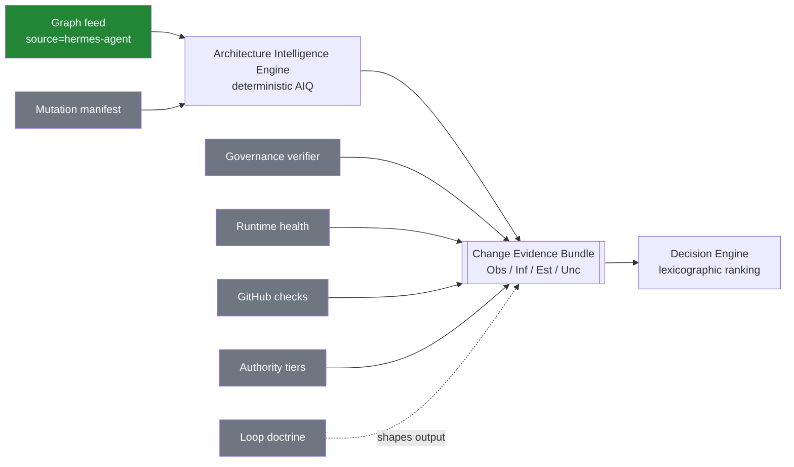
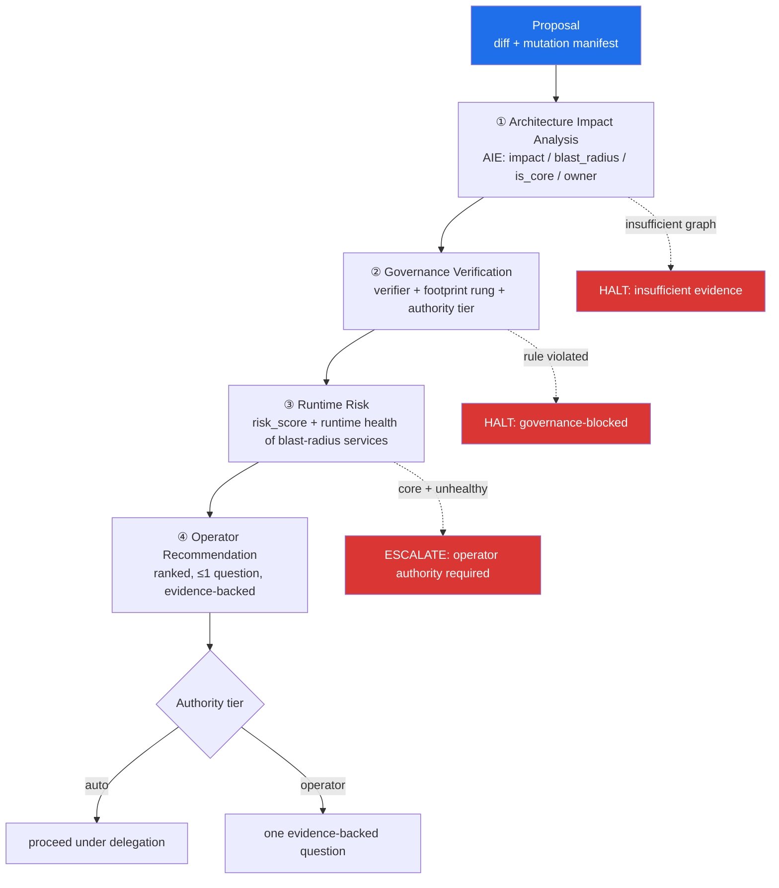
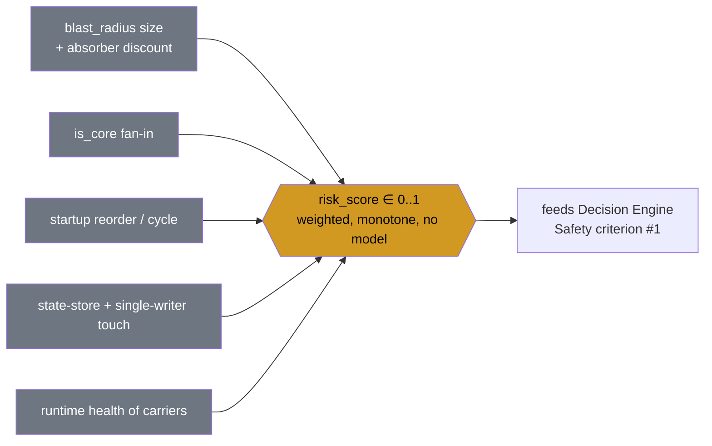

# Olympus — Architecture Intelligence Specification

How **Mission Control (the Executive Brain)** consumes the **Hermes Knowledge
Graph** to reason about proposed code changes: query engine, evidence bundle,
decision flow, risk engine, and the long-term role determination.

> **Design only. Read-only. No code, no PR, no generator.** This document does
> not generate or regenerate the graph — it specifies how an already-produced
> graph (`graph/hermes.graph.json`, schema in
> [`GRAPH_SCHEMA.md`](GRAPH_SCHEMA.md)) is *consumed*. Nothing here is wired.
> It follows the house doctrine of `docs/executive-operating-loop-contract.md`
> and `docs/chief-of-staff/DECISION_ENGINE.md`: every seam is a payload shape
> plus a governance rule; every output is evidence or silence.

- **Producer:** Hermes emits the graph (out of scope here).
- **Feed:** `evidence_feeds`, `source: hermes-agent` (already allowlisted, per
  contract §7).
- **Consumer:** Mission Control's **Architecture Intelligence Engine (AIE)**.
- **Governor:** the Decision Engine + the human. The graph informs; it never
  decides.
- **Terminal state:** `ARCHITECTURE_INTELLIGENCE_READY` (§6).

---

## 0. Doctrinal constraints inherited (non-negotiable)

Every mechanism below is bound by the invariants already ratified in the repo:

| Inherited invariant | Source | Consequence for the AIE |
|---|---|---|
| **Evidence or silence** | contract §9.1 | Every AIE answer carries receipts; `UNKNOWN` / `degraded` / `contradicted` are valid data, never gaps to fill |
| **Determinism over cleverness** | contract §9.2, PHILOSOPHY.md | AIE scoring/ranking is **pure graph algorithms** — no model calls in impact, risk, or ranking |
| **Mutation boundaries** | contract §9.3 | The AIE **reads** the graph feed; MC writes only through `MissionStore`; neither side imports the other's runtime |
| **Attention economy** | contract §9.4 | AIE output collapses to at most one operator question, only in the four evidence-backed classes |
| **Evidence-first recommendation** | DECISION_ENGINE.md | Every AIE verdict decomposes into Observation → Inference → Estimate → Uncertainty; missing any → inadmissible |
| **Lexicographic ranking** | DECISION_ENGINE.md | Safety → ROI → effort → alignment → confidence → `id`; total, deterministic, explainable |
| **Consume by recording signals, not importing** | contract §7 | The graph enters MC via `evidence_feeds.record_signal(...)`, not by importing Hermes code |

---

## 1. Architecture Intelligence Engine (how MC queries the graph)

### 1.1 What the AIE is

A **read-only, deterministic query layer inside Mission Control** that loads
the graph feed into an in-memory read model and answers a fixed catalog of
**Architecture Intelligence Queries (AIQs)**. It is the graph's counterpart to
the Compound Engine's `knowledge-growth` consumer — it turns structural facts
into admissible evidence, using only graph traversals.

### 1.2 Ingestion (the seam)

```
Hermes emits graph/hermes.graph.json  (schema_version 1.0, source=hermes-agent)
        │  (transport = existing evidence_feeds channel; NOT a code import)
        ▼
MC records the graph as a signal snapshot:
  evidence_feeds.record_signal(
    type   = "architecture-graph",
    metric = "graph_version",
    value  = "<graph_version>",
    source = "hermes-agent",
    payload_ref = <content-addressed blob of nodes[]+edges[]>)
        ▼
AIE loads the snapshot into a read model (nodes-by-id, forward+reverse adjacency)
```

Governance rules on ingestion:
- **Version handshake** — AIE accepts a graph only if `schema_version` MAJOR
  matches; unknown node/edge types are ignored, never errored (forward-compat,
  contract §1).
- **Staleness is data** — the snapshot carries `commit` + `graph_version`. If
  the graph's `commit` is behind the PR's base, the AIE emits
  `graph_staleness: degraded` as evidence — it does **not** silently answer on
  stale structure.
- **Content-addressed** — the graph blob is stored by hash; identical graphs
  dedupe; a changed hash is the drift signal.

### 1.3 The AIQ catalog (deterministic, closed set)

| AIQ | Traversal | Returns |
|---|---|---|
| `impact(path)` | reverse `imports`/`calls`/`registers-into` into node(s) at `path` | affected node set + surfaces reached |
| `blast_radius(node)` | forward `fails-to` from node | failure-propagation set + absorbers |
| `owner(node)` | `node.owner` field | ownership domain |
| `reviewers(paths[])` | paths → owning nodes → `owner` (ranked by touch count) | ordered owner list |
| `startup_order()` | topological sort over `starts-before` | ordered service list + cycles (if any) |
| `is_core(node)` | in-degree(`calls`+`imports`+`registers-into`) ≥ threshold ∧ `type ∈ {Subsystem, core Tool}` | boolean + fan-in count |
| `rollback_plan(nodes[])` | `stores-in`/`owns` + `starts-before` reverse | ordered teardown + state-store touch list |

Every AIQ is a pure function of `(graph_snapshot, args)` — same inputs, same
output, no randomness, no model temperature (DECISION_ENGINE determinism).

### 1.4 What the AIE explicitly does not do

- It does **not** call an LLM to interpret the graph.
- It does **not** mutate the graph or write back to Hermes.
- It does **not** produce recommendations — it produces **structural
  observations** that the Decision Engine ranks. (Descriptive, never
  directive.)

---

## 2. Evidence Bundle (how the graph combines with the other inputs)

An architecture verdict is never the graph alone. The AIE assembles a
**Change Evidence Bundle (CEB)** — one admissible evidence object per proposed
change — by joining the graph with six other Mission Control inputs. The CEB
is what enters the Decision Engine.

### 2.1 The six co-inputs and the graph's join to each

| Input | What it provides | How the graph joins it |
|---|---|---|
| **Governance verifier** | pass/fail on repo rules (footprint ladder, `.env`-secrets-only, cache-safety, no change-detector tests — `AGENTS.md`) | Graph tags the *type* of surface touched (`core Tool` vs `Plugin` vs `CLI`) so the verifier applies the right rung of the footprint ladder |
| **Mutation manifest** | the diff's declared surface: files, symbols, added/removed nodes | Graph resolves each mutated path → node → `type`/`owner`/edges; flags manifest gaps ("diff touches `providers/` but manifest omits it") |
| **Runtime health** | live signals: gateway up/degraded, provider breaker state, error rates | Graph maps a changed node → the services that would carry the failure (`fails-to`), so health is read *for the right services* |
| **GitHub checks** | CI status, test results, required checks | Graph attaches the checks to the owning subsystem; a red check on a `is_core` node weighs heavier than on a leaf |
| **Authority tiers** | who may approve what (operator vs delegated vs auto) | Graph's `owner` + `is_core` set the *required* tier: core-surface changes demand a higher authority tier |
| **Loop doctrine** | the operating-loop rules (attention economy, evidence-first, one-question-max) | Graph findings are shaped into ≤1 question and only the four interrupt classes; structural noise never reaches the operator |

### 2.2 Bundle shape (admissible evidence)

The CEB is structured to satisfy DECISION_ENGINE's four-part admissibility:

```jsonc
{
  "change_id": "<pr-or-proposal-id>",
  "graph_snapshot": { "graph_version": "...", "commit": "...", "staleness": "fresh|degraded" },
  "observation": {                       // what was seen (graph + manifest + health + checks)
    "mutated_nodes": [ /* node ids + types + owners */ ],
    "impact_set":    [ /* AIQ impact() */ ],
    "blast_radius":  [ /* AIQ blast_radius() */ ],
    "runtime_health": { /* per affected service */ },
    "github_checks":  { /* per owning subsystem */ }
  },
  "inference": {                         // reasoning, stated to be attacked
    "surface_class": "core-tool|plugin|cli|config|...",
    "governance": { "verifier": "pass|fail", "rung_required": "..." },
    "authority_tier_required": "operator|delegated|auto"
  },
  "estimate": {                          // explicit numbers, not adjectives
    "risk_score": 0.0,                   // §4 deterministic
    "reviewer_ranking": [ /* owners */ ],
    "operator_effort_minutes": 0,
    "confidence": 0.0
  },
  "uncertainty": [ "graph_staleness", "manifest_gap", "unknown_edge_type" ]
}
```

Governance rule: **any missing section makes the bundle inadmissible** — the
AIE returns `insufficient evidence` rather than fabricating a verdict
(DECISION_ENGINE's worst-failure-mode rule). A bundle built on a `degraded`
graph snapshot is admissible *only* with `uncertainty: [graph_staleness]`
surfaced.

### 2.3 Bundle assembly (Mermaid)



---

## 3. Decision Flow (proposal → operator recommendation)

Every proposed code change traverses four gates. Each gate consumes the CEB,
can only **narrow** (never fabricate), and can **halt** with an admissible
"insufficient evidence" / "blocked" verdict.



### Stage contracts

| Stage | Input | Produces | Halt condition |
|---|---|---|---|
| **① Architecture Impact Analysis** | mutated paths + graph | `impact_set`, `blast_radius`, `is_core`, `surface_class` | graph missing/stale beyond tolerance → `insufficient evidence` (never guess structure) |
| **② Governance Verification** | impact + verifier + footprint ladder | `governance: pass/fail`, `rung_required`, `authority_tier_required` | a hard rule violated (e.g. new core tool where a skill suffices; `.env` for non-secret) → `governance-blocked` |
| **③ Runtime Risk** | blast_radius + runtime health + GitHub checks | `risk_score` (§4), health-adjusted | `is_core` node ∧ its carrying services `degraded` → escalate to operator tier |
| **④ Operator Recommendation** | full CEB | one ranked recommendation, evidence attached | — (terminal; obeys attention economy) |

**Recommendation object** (mirrors DECISION_ENGINE): Observation (what the
graph + health show), Inference (surface class + governance), Estimate
(risk_score, reviewer ranking, effort, confidence — explicit numbers),
Uncertainty (staleness / manifest gaps). Ranking across competing proposals is
the existing lexicographic contract — **Safety first**, and `risk_score` feeds
that Safety criterion. No model call anywhere in the flow.

---

## 4. Risk Engine (how the graph contributes)

The Risk Engine is deterministic and produces a `risk_score ∈ [0,1]` plus
five structured outputs. The graph is the **structural half** of each; the
other half comes from runtime health and the mutation manifest.

### 4.1 Blast radius
- **Graph contribution:** forward `fails-to` traversal from each mutated node
  yields the *reachable* failure set; `is_core` fan-in bounds the *maximum*
  reach.
- **Fused with:** runtime health of the reachable services (a large radius
  whose services are all healthy and have absorbers — `fallback_model`,
  `credential_pool` — scores lower than a small radius hitting an already
  `degraded` service).
- **Output:** `blast_radius = { nodes[], absorbers[], carrying_services[] }`.

### 4.2 Ownership
- **Graph contribution:** `node.owner` for every mutated + impacted node.
- **Output:** `owners = { primary, secondary[] }` — the escalation and
  accountability target. Feeds authority-tier selection.

### 4.3 Reviewer suggestion
- **Graph contribution:** mutated paths → owning nodes → `owner`, ranked by
  count of touched nodes per owner; `is_core` nodes force at least one
  core-owner reviewer.
- **Output:** ordered reviewer list (deterministic; ties broken by owner id) —
  directly usable by the `AGENTS.md` triage sweeper.

### 4.4 Startup dependency
- **Graph contribution:** topological order over `starts-before`; detect
  whether a mutated service moves earlier/later or introduces a cycle.
- **Output:** `startup_impact = { affected_order[], new_cycles[] }` — a change
  that reorders or cycles startup is a distinct, high-weight risk signal
  (e.g. moving the cron ticker before `runner.start()`).

### 4.5 Rollback planning
- **Graph contribution:** for the mutated node set, `stores-in`/`owns` edges
  enumerate the **state stores touched** (e.g. `state.db`, `kanban.db`), and
  reverse `starts-before` gives a safe **teardown order**.
- **Output:** `rollback_plan = { teardown_order[], state_stores[], single_writer_risks[] }`.
  A change touching a single-writer store (kanban dispatcher → `kanban.db`)
  flags that rollback must preserve the single-writer invariant.

### 4.6 Score composition (deterministic)



The composition is a fixed monotone weighting — **explainable** (the engine
can name which term dominated) and **total** (every change gets a comparable
number), satisfying the ranking contract. No term is an LLM judgment.

---

## 5. Long-term architecture — what the graph should become

**Determination: the Knowledge Graph is (c) an Evidence Feed — and only that.
The intelligence is (b), and lives in Mission Control's engine, not in the
graph.**

### 5.1 The four candidates, judged against doctrine

| Candidate | Verdict | Rationale |
|---|---|---|
| **(a) Executive Memory** | **No** | Memory in this system means *governed, accumulated claims with tiered promotion* (`memorygraph`: candidate→established→core, evidence-gated, contradictions flagged). The graph is the opposite: **stateless and regenerated wholesale** every architecture change. It accumulates nothing, promotes nothing, and has no contradiction lifecycle. Treating it as memory would violate the mutation-boundary invariant (memory is a *governed store* MC owns; the graph is a *feed* Hermes produces). |
| **(b) Executive Intelligence** | **Partly — but not the graph itself** | Intelligence is the *reasoning* (impact, blast radius, risk). That reasoning is the **AIE**, which lives in Mission Control. The graph is its fuel, not the engine. Calling the graph "intelligence" would smuggle reasoning into a data artifact and blur where determinism must hold. |
| **(c) Evidence Feed** | **Yes — canonical role** | The graph is descriptive, evidence-bearing (`source` on every node/edge), versioned, allowlisted (`source: hermes-agent`), consumed by *recording signals not importing* (contract §7), and **descriptive never directive**. This is exactly the evidence-feed contract already ratified for `memorygraph`. |
| **(d) Something else** | **No new category needed** | The existing taxonomy is sufficient; inventing a category would fragment the doctrine. |

### 5.2 The precise statement

```
The Hermes Knowledge Graph is an Evidence Feed (c).
It fuels the Architecture Intelligence Engine, which is Executive Intelligence (b),
which lives in Mission Control and reasons deterministically.
The graph is NOT Executive Memory (a): it is regenerated, not accumulated;
descriptive, not governed; a feed Hermes produces, not a store MC owns.
```

### 5.3 Why this separation matters

- **Determinism stays where it must.** The feed is inert data; all reasoning
  (which must be model-free and reproducible) is isolated in the AIE. If the
  graph were "intelligence," the determinism boundary would be ambiguous.
- **Mutation boundaries hold.** Hermes owns graph production; MC owns the AIE
  and `MissionStore`. Neither writes the other's store — the graph crosses the
  boundary as a recorded signal, exactly like memory-graph counts.
- **Evidence-or-silence is enforceable.** A feed can be `degraded`/`stale` and
  say so; "memory" implies a trusted accumulated truth that a possibly-stale
  structural snapshot must never impersonate.
- **Graceful degradation.** A missing or stale feed degrades the AIE to
  "architectural context unavailable" — an admissible `UNKNOWN`, never a
  fabricated verdict and never a runtime error.

### 5.4 Evolution path (design intent, not a build)

1. Graph ships as an evidence feed (`source: hermes-agent`), recorded as an
   `architecture-graph` signal — smallest step, reuses the existing allowlist.
2. AIE consumes it read-only for the four-gate decision flow (§3).
3. Risk Engine (§4) feeds the Safety criterion of the existing lexicographic
   ranking.
4. Longer term, MC may *derive* governed architectural claims (e.g. "the
   narrow waist has widened" as a promotable, evidence-gated observation) —
   **those** governed derivations would live in MC's memory, produced *from*
   the feed. The feed itself never becomes memory; memory is what the engine
   chooses to remember about it.

---

## 6. Terminal state

```
ARCHITECTURE_INTELLIGENCE_READY
```

This specification defines: the **Architecture Intelligence Engine** and its
deterministic AIQ catalog (§1); the **Change Evidence Bundle** joining the
graph with the governance verifier, mutation manifest, runtime health, GitHub
checks, authority tiers, and loop doctrine (§2); the four-gate **Decision
Flow** from proposal to operator recommendation (§3); the deterministic **Risk
Engine** contributions — blast radius, ownership, reviewer suggestion, startup
dependency, rollback planning (§4); and the **long-term determination** — the
graph is an **Evidence Feed** fueling **Executive Intelligence**, explicitly
not Executive Memory (§5).

Every mechanism obeys the ratified invariants: evidence or silence, determinism
over cleverness, mutation boundaries, attention economy, evidence-first
admissibility. Nothing is implemented; nothing is wired; no graph was generated.
The design is ready for a Chad-approved wiring milestone.
