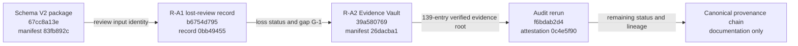

# Olympus Provenance Graph

**Graph status:** `PROVENANCE_CHAIN_COMPLETE`

## Canonical directed acyclic graph

No reverse edge exists. The graph therefore contains no circular provenance.

## Artifact identities

| Node | Originating commit | Branch | Manifest or integrity anchor | Dependent artifacts | Superseded artifacts | Current audit status |
|---|---|---|---|---|---|---|
| Schema V2 package | `67cc8a13e94355daee7266a27613dbebbda6d953` | `review/olympus-schema-v2-package-20260717` | `review/schema-v2-file-manifest.sha256` (`83fb892ce28354ec32a7899d8f1ae9885cd01a21add0e823feae1ff276c6b3ff`) | R-A1; vault package snapshot; fixture lineage | None | Integrity PASS; independent review UNESTABLISHED |
| R-A1 | `b6754d795f354d4af5300cbcf264b0d7928a8651` | `remediation/olympus-audit-records-20260717` | Path-B record hash `0bb494552e9abff10bda1ba4e871aa63188beb63596db4145997f3b446bbc751`; no manifest | Vault gap G-1; rerun finding `AUD-A1-01` | Reconstruction-based review claims | Lost record; STILL VALID finding |
| R-A2 | `39a580769de94668d6c681b50468001080296916` | `remediation/olympus-evidence-vault-20260717` | `evidence/EVIDENCE-MANIFEST.sha256` (`26dacba1e49cc4557b3f71348203ad6facc17d0041d4711bcacec6e8c2632b51`) | Audit rerun and certification matrix | Dispersed evidence as audit reference; not source originals | Vault PARTIAL; integrity PASS |
| Audit rerun | `f6bdab2d418aa54930e19a79d6161fe2b454a5d6` | `remediation/olympus-audit-rerun-20260717` | `HASH-ATTESTATION-RERUN.txt` (`0c4e5f909f05a54be3d927b9a910524329b0206653343a5d2e1b00e0945d7ba1`) | Provenance-chain documents and remaining-remediation set | Earlier finding-status snapshot only | `OLYMPUS_REMEDIATION_REQUIRED` |

## Git graph versus evidence graph

The Git graph preserves actual commit authorship and chronology. The evidence graph
adds a cryptographic dependency edge from R-A1 to R-A2 because the vault's G-1 gap
depends on the R-A1 determination. This cross-reference does not rewrite, merge, or
pretend ancestry between the sibling commits.
