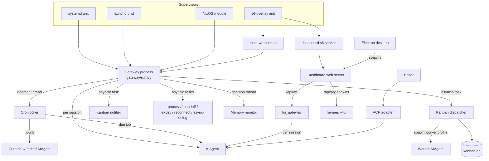
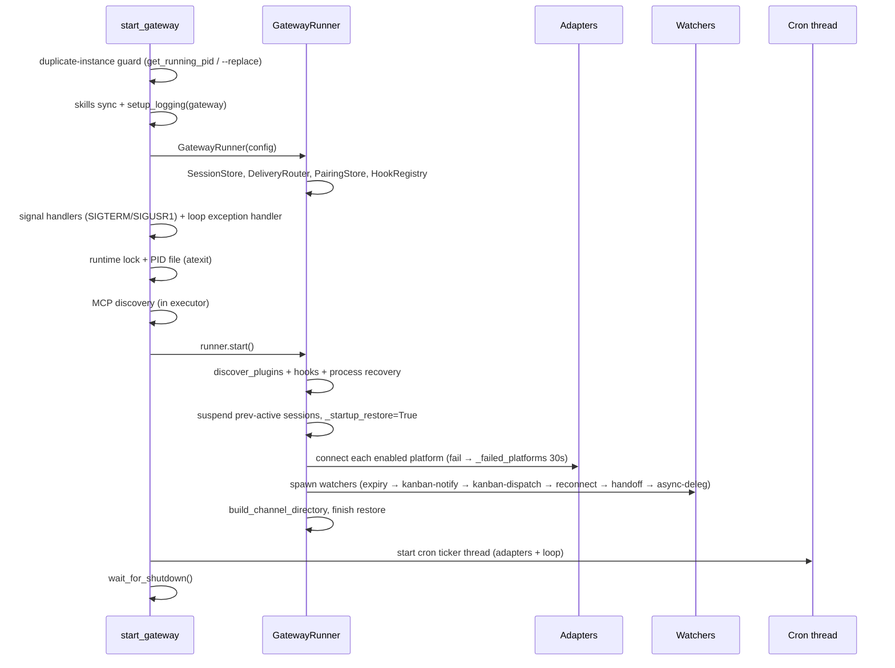
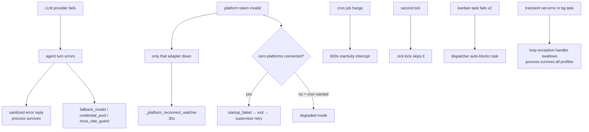

# Hermes — Service Relationships

The long-running services in Hermes: what each is, who starts whom, startup
order, the locks/PIDs that coordinate them, failure propagation, and
ownership.

> Analysis only. "Service" here means any process or long-lived loop with a
> lifecycle — supervised daemons, in-process watchers, and RPC listeners.

---

## 1. Service inventory

| Service | Where it runs | Started by | Lock / PID | Logs |
|---|---|---|---|---|
| **Gateway** | own process | `hermes gateway run` → `gateway/run.py:start_gateway` (supervised by systemd/launchd/s6/NixOS) | `gateway.lock` + `gateway.pid`; per-identity scoped locks | `gateway.log` |
| **Cron ticker** | daemon thread *inside gateway* | `_start_cron_ticker` (60s) | `cron/.tick.lock` (non-blocking flock) | `agent.log` |
| **Kanban dispatcher** | asyncio task *inside gateway* | `_kanban_dispatcher_watcher` (gated `kanban.dispatch_in_gateway`) | `kanban.db` WAL; standalone `%t/hermes-kanban-dispatcher.pid` | `kanban/logs/<task>.log` |
| **Kanban notifier** | asyncio task *inside gateway* | `_kanban_notifier_watcher` (5s) | — | `agent.log` |
| **Curator** | forked `AIAgent`, hourly poll | `agent/curator.py:maybe_run_curator` (from cron ticker) | `skills/.curator_state` | `agent.log` |
| **Process watcher** | asyncio task per bg process | `_run_process_watcher` | `process_registry` checkpoint | `agent.log` |
| **Async-delegation / handoff / expiry / reconnect watchers** | asyncio tasks *inside gateway* | `runner.start()` | — | `gateway.log` |
| **Memory monitor** | daemon thread | `gateway/memory_monitor.py` (300s) | — | `[MEMORY]` lines |
| **Dashboard web server** | own process (uvicorn) | `hermes dashboard` → `web_server.py` | process-table scan (no PID file) | `gui.log` |
| **TUI gateway** | own process | `python -m tui_gateway.entry` (spawned by Ink / dashboard PTY) | — | crash log |
| **ACP adapter** | own process | `hermes-acp` | — | stderr |
| **Proxy** | own process | `hermes proxy start` | — | — |
| **API-server platform** | in gateway (aiohttp) | `platforms.api_server` | port 8642 | `gateway.log` |
| **Webhook platform** | in gateway (aiohttp) | `platforms.webhook` | port 8644 | `gateway.log` |

---

## 2. Supervision & who-starts-whom (Mermaid)

Key relationships:
- The **gateway is the hub** for autonomous work: cron, kanban, curator, and
  all watchers live inside it. There is **no separate cron daemon** — the
  persistent tick loop only exists in the gateway (standalone `hermes cron
  tick` runs exactly one tick).
- The **dashboard is the hub** for interactive GUI work: it hosts the
  `tui_gateway` (via `/api/ws`) and embeds `hermes --tui` (via `/api/pty`).
- The **desktop app** spawns its own dashboard backend and connects over WS.

---

## 3. Gateway internal startup order

**Docker s6 order:** `/init` (PID 1) → `cont-init.d` lexicographically
(`01-hermes-setup` → `015-supervise-perms` → `02-reconcile-profiles`) → s6-rc
`user` bundle brings up `main-hermes` (no-op `sleep infinity`) + `dashboard`
(only if `HERMES_DASHBOARD` set) after `base` → `/init` execs
`main-wrapper.sh` as the container main program.

---

## 4. Coordination primitives (locks, PIDs, markers)

| Primitive | Path | Purpose |
|---|---|---|
| Gateway runtime lock | `~/.hermes/gateway.lock` (flock) | one gateway per `HERMES_HOME` |
| Gateway PID file | `~/.hermes/gateway.pid` (PID + start_time) | stale-detection, `status`, `stop` |
| Scoped identity locks | `HERMES_GATEWAY_LOCK_DIR/<scope+identity>` | prevents two gateways sharing a bot token / phone across profiles |
| Cron tick lock | `~/.hermes/cron/.tick.lock` (non-blocking flock) | prevents overlapping ticks |
| Cron jobs lock | `~/.hermes/cron/.jobs.lock` (flock + RLock) | atomic `jobs.json` writes |
| Kanban dispatcher PID | `%t/hermes-kanban-dispatcher.pid` (standalone only) | single-dispatcher invariant |
| WhatsApp bridge PID | `<session>/bridge.pid` | Node bridge lifecycle |
| Takeover / planned-stop markers | filesystem markers (PID+start_time+TTL) | distinguish planned restart vs crash |

The **single-dispatcher invariant** is load-bearing: the kanban dispatcher
runs embedded in the gateway XOR standalone (`--force`), never both — two
dispatchers race on `kanban.db`.

---

## 5. Restart & drain semantics

| Supervisor | Restart policy | Drain mechanism |
|---|---|---|
| systemd | `Restart=always`, `RestartSec=5` | `RestartForceExitStatus=<code>` + `ExecReload=/bin/kill -USR1 $MAINPID`; `TimeoutStopSec=max(60,drain)+30` |
| launchd | `KeepAlive=true` | exit-code signalling |
| s6 | supervise auto-restart | `finish` script exit 125 = permanent-failure (dashboard-disabled slot stays down) |
| NixOS | `Restart=always`, `RestartSec=5` | container-identity hash gates recreation |

- `/restart` from chat and `SIGUSR1` (service restart) exit with code 75 →
  supervisor revives cleanly (drain-aware).
- Unexpected signal → exit 1 → `Restart=on-failure` revives.
- Self-kill guard: `hermes gateway stop/restart` refuses when
  `_HERMES_GATEWAY=1` (inside the gateway) to avoid supervisor loops.
- Stuck-loop sessions are auto-suspended across restarts (≥3 consecutive
  restarts).

---

## 6. Failure propagation across services

The design goal throughout: **isolate failures to the smallest scope** — a
bad provider hits one turn, a bad token hits one adapter, a hung job hits one
job — and never let a background exception take down the shared event loop
(which would kill every profile).

---

## 7. Ownership map (which service owns which state)

| State | Owner service | Access pattern |
|---|---|---|
| `state.db` (sessions/messages/FTS5) | `hermes_state.SessionDB` — read/written by gateway `SessionStore`, cron, CLI | SQLite WAL |
| `jobs.json` + cron output | cron scheduler | flock + atomic writes |
| `kanban.db` | kanban dispatcher (single-writer invariant) | SQLite WAL |
| `skills/` + `.usage.json` + `.curator_state` | curator + `skill_usage` | lock-guarded sidecar |
| `config.yaml` | config loaders (CLI / canonical / gateway) | deep-merge, mtime-cached |
| `.env` / `auth.json` | credential resolvers | secrets only |
| `gateway.lock` / `gateway.pid` / scoped locks | `gateway/status.py` | flock / marker files |
| Per-session `AIAgent` cache | `GatewayRunner._agent_cache` | LRU (128, 1h idle TTL) keyed by `session_key` + config signature |
| Memory (external) | active `MemoryProvider` via `MemoryManager` | one provider, background sync executor |

---

## 8. Cron / kanban / curator: the autonomous triad

These three share the gateway's lifecycle but have distinct cadences:

| | Poll rate | Actual work rate | Isolation |
|---|---|---|---|
| **Cron** | 60s tick | per-job schedule | 600s inactivity timeout; disables `cronjob`/`messaging`/`clarify` toolsets; prompt-injection scan; separate cron session (not mirrored into gateway session) |
| **Kanban** | `dispatch_interval_seconds` (60) | per-ready-task | board = hard boundary (`HERMES_KANBAN_BOARD` pinned); tenant = soft namespace; auto-block after `failure_limit` (2) |
| **Curator** | hourly (from cron ticker) | `interval_hours` (default 7 days) | only `created_by: agent` skills; archive-only; pinned exempt; uses auxiliary client (won't pollute main prompt cache) |

Poll rate ≠ work rate: the curator is *checked* hourly but *runs* about
weekly; kanban and cron are checked every minute but act only when there's
due/ready work.
