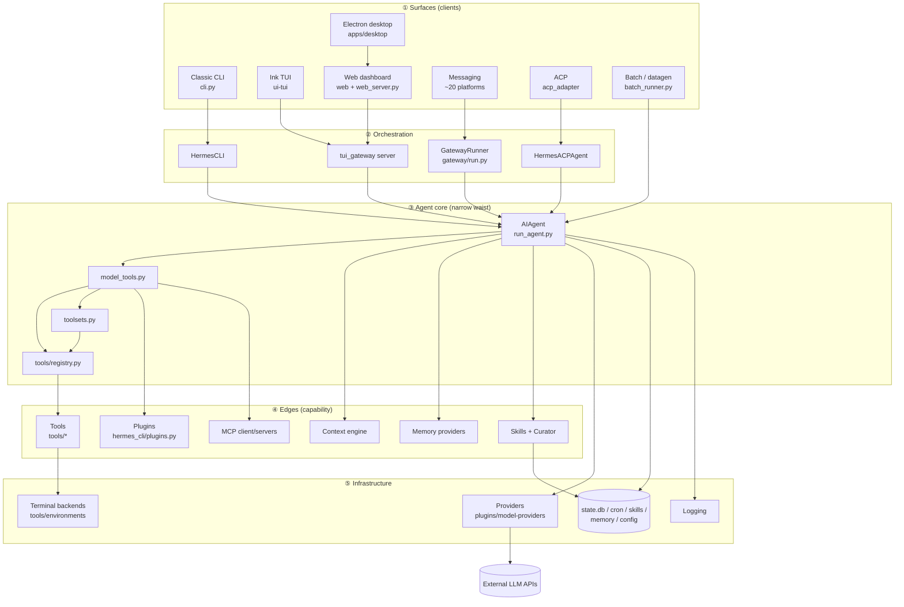
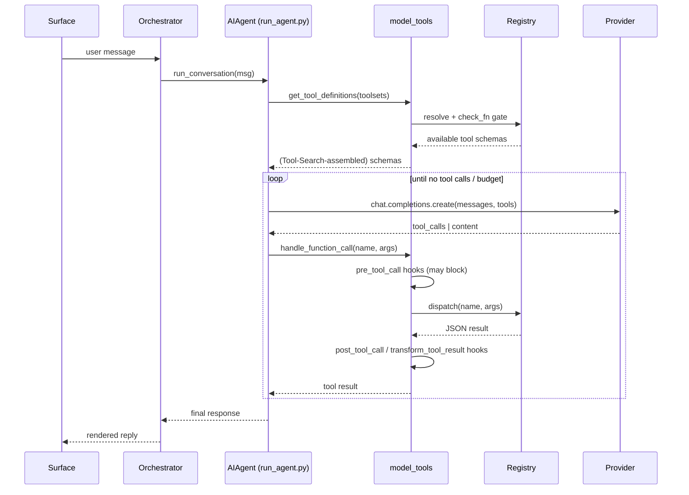
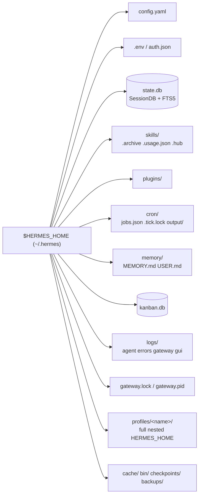

# Hermes — System Map

A layered map of the Hermes agent: the surfaces users touch, the
orchestrators that drive conversations, the shared agent core, the edge
extension systems, and the infrastructure underneath.

> Analysis only. The core principle, from `AGENTS.md`: **the core is a narrow
> waist; capability lives at the edges.** One agent core (`run_agent.py`)
> serves every surface; breadth is added through plugins, skills, providers,
> and platform adapters — not by growing the core.

---

## 1. The one-core invariant

There is exactly one conversation engine — `run_agent.py::AIAgent` — and
every surface is a thin client of it:

- **CLI** (`cli.py`) constructs an `AIAgent` directly.
- **TUI / desktop / dashboard chat** all funnel through
  `tui_gateway/server.py`, which constructs an `AIAgent` per session.
- **Messaging** (`gateway/run.py`) constructs a per-`session_key` `AIAgent`.
- **ACP** (`acp_adapter/server.py`) drives an `AIAgent`.
- **Cron / kanban / delegation** spawn fresh or child `AIAgent`s.

Slash commands everywhere resolve through one registry
(`hermes_cli/commands.py`) and, in the GUI surfaces, one `_SlashWorker`
subprocess that reuses the full `HermesCLI`.

---

## 2. Layered architecture (Mermaid)

---

## 3. Subsystem catalog

### ① Surfaces
| Surface | Path | Transport to core |
|---|---|---|
| Classic CLI | `cli.py` (`HermesCLI`) | in-process |
| Ink TUI | `ui-tui/` (+ vendored `@hermes/ink`) | stdio JSON-RPC → `tui_gateway` |
| Electron desktop | `apps/desktop/` | WS `/api/ws` → `tui_gateway` |
| Web dashboard | `web/` → `hermes_cli/web_dist/` | REST `/api/*` + WS + PTY |
| Messaging gateway | `gateway/` | per-platform → `GatewayRunner` |
| ACP (editors) | `acp_adapter/` | stdio JSON-RPC |
| Batch / research | `batch_runner.py`, `mini_swe_runner.py`, `trajectory_compressor.py` | in-process |

### ② Orchestration
- `cli.py` — `HermesCLI` REPL, slash registry, skin engine, session DB
- `tui_gateway/server.py` — JSON-RPC dispatcher; `_make_agent` builds `AIAgent` + `_SlashWorker` per session; three transports (stdio / WS / tee-sidecar)
- `gateway/run.py` — `GatewayRunner`: adapters, sessions, watchers, cron thread, kanban tasks
- `acp_adapter/server.py` — `HermesACPAgent` protocol implementation

### ③ Agent core (the narrow waist)
- `run_agent.py` — `AIAgent`: the synchronous conversation loop, budget/interrupt handling, provider client construction, transport dispatch, agent-level tool interception (`todo`, `memory`, `session_search`, `delegate_task`, `clarify`, `read_terminal`)
- `model_tools.py` — `discover_builtin_tools()`, `get_tool_definitions()`, `handle_function_call()`, plugin hook fan-out, Tool Search assembly
- `toolsets.py` — `TOOLSETS` dict, `_HERMES_CORE_TOOLS`, `resolve_toolset()`
- `tools/registry.py` — the registration singleton (schema/handler/check_fn/requires_env), auto-discovery

### ④ Edges
- **Tools** (`tools/*.py`) — ~40 built-in tools, each self-registering into a toolset, most `check_fn`-gated
- **Plugins** (`hermes_cli/plugins.py` + `plugins/*`) — general lifecycle-hook/tool/CLI plugins plus specialized registries
- **Skills** (`skills/`, `optional-skills/`, `tools/skills_hub.py`) — procedural memory; `agent/curator.py` lifecycle
- **Memory providers** (`plugins/memory/*`, `agent/memory_manager.py`) — pluggable cross-session memory (one active)
- **MCP** (`tools/mcp_tool.py`, `optional-mcps/`, `mcp_serve.py`) — client + catalog + Hermes-as-server
- **Context engine** (`agent/context_engine.py`, default `agent/context_compressor.py`) — compression

### ⑤ Infrastructure
- **Providers** (`providers/__init__.py`, `plugins/model-providers/*`) — 28 inference backends
- **Terminal backends** (`tools/environments/*`) — local, docker, ssh, singularity, modal (direct + managed), daytona
- **Storage** — `~/.hermes/` (config, `.env`, `state.db`, skills, plugins, cron, memory, logs, profiles)
- **Logging** (`hermes_logging.py`) — `agent.log`, `errors.log`, `gateway.log`, `gui.log`

---

## 4. Extension registries (the "edges" in detail)

Hermes has **multiple parallel discovery systems**, deliberately kept
separate so each edge category grows without touching the core:

| Registry | Discovery driver | Selected by | ABC / target |
|---|---|---|---|
| Built-in tools | `discover_builtin_tools()` (glob `tools/*.py`) | toolset membership | `tools/registry.py` |
| General plugins | `PluginManager` (`hermes_cli/plugins.py`) | `plugins.enabled` | `register(ctx)` |
| Model providers | `providers/_discover_providers()` (lazy) | `model.provider` | `ProviderProfile` |
| Memory providers | `plugins/memory/__init__.py` | `memory.provider` | `MemoryProvider` |
| Context engines | `plugins/context_engine/__init__.py` | `context.engine` | `ContextEngine` |
| MCP servers | `discover_mcp_tools()` | `mcp_servers.*` config | MCP protocol |
| Platform adapters | `gateway/platform_registry.py` | `platforms.*` config | `BasePlatformAdapter` |
| Dashboard plugins | `web_server.py:_discover_dashboard_plugins` | `dashboard/manifest.json` | FastAPI sub-router |
| Image/video/web/browser/TTS/STT/auth | `agent/*_registry.py`, `hermes_cli/dashboard_auth/` | respective config keys | per-domain ABC |

---

## 5. Request lifecycle (a single turn)

Agent-level tools (`todo`, `memory`, `session_search`, `delegate_task`,
`clarify`, `read_terminal`) are intercepted in
`agent/agent_runtime_helpers.py:invoke_tool` *before* `handle_function_call`,
because they need per-agent-instance state.

---

## 6. `~/.hermes/` state directory

Profiles (`profiles/<name>/`) are complete isolated `HERMES_HOME`
directories, selected via `-p/--profile` before any module imports
(`_apply_profile_override`). All state access goes through
`hermes_constants.get_hermes_home()` so it scopes to the active profile.

---

## 7. Cross-surface consistency guarantees

- **Prompt caching is sacred** — the system prompt is byte-stable for a
  conversation's life; toolsets never change mid-conversation; the only
  context mutation is compression (`agent/context_compressor.py`).
- **One slash-command registry** feeds CLI, gateway help, Telegram menu,
  Slack subcommands, autocomplete, and desktop palette.
- **One tool registry** is shared by built-in tools, plugins, and MCP
  servers (namespaced `mcp-<server>`).
- **Profile isolation** — every subsystem reads `get_hermes_home()`, so
  config, credentials, sessions, skills, cron, and gateway locks are all
  per-profile.
