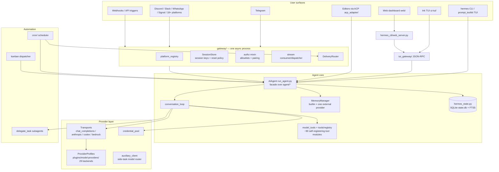
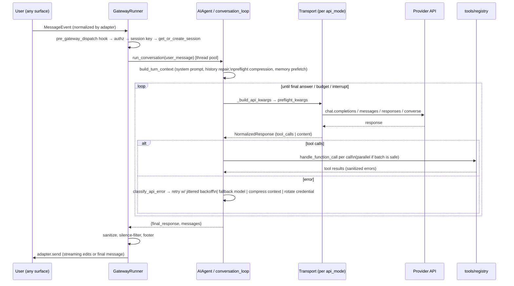
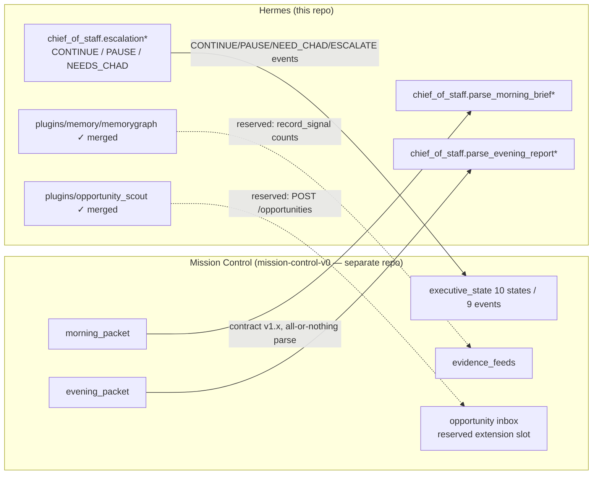

# Hermes Architecture Reference

System-level architecture of this repository: the Hermes Agent framework
(upstream, Nous Research) plus Chad's Chief of Staff layer. For
per-module detail see [MODULE_REFERENCE.md](MODULE_REFERENCE.md).

Part of the [Hermes Engineering Handbook](README.md).

---

## 1. The big picture



Load-bearing facts:

- **`run_agent.py`'s `AIAgent` is a thin facade** — nearly every method
  forwards to an extracted module under `agent/` (`conversation_loop`,
  `agent_init`, `chat_completion_helpers`, `tool_executor`,
  `error_classifier`, `context_compressor`, …).
- **The gateway is one asyncio process serving all chat platforms.**
  Adapters share the event loop; the synchronous agent runs in a thread
  pool (`run_in_executor` with contextvars carried across).
- **Everything user-owned lives under `HERMES_HOME`** (default
  `~/.hermes`, profile-aware). Never hardcode the path; use
  `get_hermes_home()`.
- **Prompt caching must not break** (AGENTS.md policy): no mid-
  conversation system-prompt rebuilds, toolset changes, or memory
  reloads. The only sanctioned context mutation is compression, which
  rotates the session (child session with `parent_session_id` lineage).

## 2. Module boundaries and dependency chain

```
tools/registry.py            (no deps — imported by all tool files)
       ↑
tools/*.py                   (each calls registry.register() at import)
       ↑
model_tools.py               (imports registry + triggers tool discovery)
       ↑
run_agent.py, cli.py, batch_runner.py, environments/
```

Boundary rules that reviewers enforce:

1. **Plugins must not modify core files** (`run_agent.py`, `cli.py`,
   `gateway/run.py`, `hermes_cli/main.py`). If a plugin needs a missing
   capability, extend the generic plugin surface (new hook / ctx method).
2. **The in-tree memory-provider set is closed** — new memory backends
   ship as standalone plugin repos implementing the same
   `MemoryProvider` ABC.
3. **Each engine writes only its own store** (contract §9 "mutation
   boundaries"): memorygraph → `memory_graph.db`; opportunity scout →
   `opportunity_scout_store.json`; sessions → `state.db`; Mission
   Control (separate repo) writes only through its own `MissionStore`.
4. **`gateway/` and `tui_gateway/` are different subsystems** despite the
   name: the former is multi-platform messaging; the latter is the
   JSON-RPC backend the Ink TUI, dashboard chat, and desktop app drive.

## 3. One agent turn (routing)



Session keys are the routing spine:
`agent:main:<platform>:<chat_type>:<chat_id>[:<thread_id>][:<user_id>]`
(`gateway/session.py::build_session_key`). Threads are shared across
participants by default; group sessions are per-user by default.

## 4. Provider abstraction

Three cooperating layers, all pluggable:

| Layer | Contract | Selection |
|---|---|---|
| **ProviderProfile** (`providers/base.py`) | Declarative: base_url, env_vars, auth_type (api_key / oauth_device_code / oauth_external / copilot / aws_sdk), api_mode, header/extra-body hooks, fallback models | `plugins/model-providers/<name>/` registers at import; user plugins override bundled (last-writer-wins) |
| **Transport** (`agent/transports/`) | Normalize request/response per `api_mode`: `chat_completions` (default), `anthropic_messages`, `codex_responses`, `bedrock_converse` (+ `codex_app_server` which bypasses the loop entirely) | `get_transport(api_mode)` |
| **Auxiliary router** (`agent/auxiliary_client.py`) | Side-task models (compression, vision, titles, curator) behind a uniform `.chat.completions.create()`; auto-detection chain openrouter → nous → custom → api-key; per-task config `auxiliary.<task>.model` | `resolve_provider_client(...)` |

Resilience wrapped around them: `error_classifier` (8-stage
classification → `FailoverReason`), fallback chains
(`try_activate_fallback` with primary-recovery cooldown),
`credential_pool` (multi-key rotation, OK/EXHAUSTED/DEAD),
`jittered_backoff` (decorrelated, counter-salted). Model switching at
runtime: `hermes model` / `switch_model()` — no code changes.

## 5. Plugin system

Two discovery systems, deliberately separate:

- **General plugins** (`hermes_cli/plugins.py::PluginManager`): four
  sources — bundled `plugins/`, user `~/.hermes/plugins/`, project
  `./.hermes/plugins/` (opt-in), pip entry points
  (`hermes_agent.plugins`). Each plugin = `plugin.yaml` manifest +
  `register(ctx)`. Kinds: `standalone` (opt-in via `plugins.enabled`),
  `backend` (bundled auto-load), `exclusive` (one active per category,
  e.g. memory), `platform` (gateway adapter), `model-provider` (recorded
  but NOT imported here).
- **Model-provider plugins** (`providers/__init__.py`): lazy, scanned on
  first profile lookup, registers `ProviderProfile`s.

The `PluginContext` surface is the extension API: tools, lifecycle hooks
(`pre/post_tool_call`, `pre/post_llm_call`, `pre_gateway_dispatch`, …),
middleware (behavior-changing, `hermes.middleware.v1`), CLI subcommands,
slash commands, skills, auxiliary tasks, and typed provider slots
(context engine, image gen, TTS, dashboard auth, platforms…).
Discovery-timing pitfall: `discover_plugins()` runs as a side effect of
importing `model_tools.py`; call it explicitly (idempotent) if you read
plugin state without that import.

## 6. Memory

```mermaid
flowchart LR
    subgraph Always on
        BM[Builtin memory\nMEMORY.md / USER.md + nudges]
        SS[session_search\nFTS5 over state.db — zero LLM cost]
    end
    subgraph One external provider — memory.provider
        MG[memorygraph ★ governed KG\nmemory_graph.db]
        HON[honcho — dialectic user modeling]
        OTH[supermemory / mem0 / holographic / hindsight / …]
    end
    MM[MemoryManager] --> BM
    MM --> MG
    MM -. selects exactly one .-> HON & OTH
    AG[AIAgent turn] -->|sync_turn / prefetch\nsingle-worker executor| MM
    AG --> SS
```

- `MemoryManager` orchestrates builtin + **at most one** external
  provider; all sync/prefetch dispatches through a single-worker
  executor so a wedged provider can never stall the conversation loop.
  Prefetched memory is fenced in `<memory-context>` blocks and scrubbed
  from streams (state-machine scrubber survives chunk splits).
- **memorygraph** (Chad's provider, merged): typed entities,
  time-aware relationships, claims with tiers
  `candidate → established → core`, evidence-gated promotion,
  contradiction flagging (never auto-resolved, never promoted), aging
  decay with demotion, append-only `governance_log`. One tool:
  `graph_memory` (remember / link / about / query / timeline /
  contradictions / resolve / duplicates / feedback / forget / sweep /
  stats). Pure stdlib + sqlite3; deterministic (injectable clock).
- Cron sessions run with `skip_memory=True` by design.

## 7. Mission Control integration (Chad's layer)

Status: **contract only — nothing is wired.** The seams are recorded in
`docs/executive-operating-loop-contract.md` (M21); the `chief_of_staff`
package itself lives in open PR #5 (interface-only, excluded from the
wheel) and **does not exist on main**.



`*` = PR #5 only. `✓` = merged and Mission-Control-agnostic today.

Invariants every seam must preserve (contract §9): **evidence or
silence**; **determinism over cleverness** (no model calls in ranking,
escalation, or status); **mutation boundaries**; **attention economy**
(four interrupt classes — safety, judgment, missing-evidence,
explicit-approval — one question max); **never chase opportunities
autonomously**; expert-witness isolation. Wiring happens only through
the roadmap in contract §11, one Chad-approved milestone at a time.

## 8. Telegram (canonical platform adapter)

`gateway/platforms/telegram.py` (python-telegram-bot):

- **Two intake modes**: long-polling (default) or webhook
  (`TELEGRAM_WEBHOOK_URL` — refuses to start without
  `TELEGRAM_WEBHOOK_SECRET`). A scoped bot-token lock prevents two
  gateways/profiles polling one bot (the 409-Conflict trap).
- **Auth is layered**: `TELEGRAM_ALLOWED_USERS` →
  `TELEGRAM_GROUP_ALLOWED_USERS`/`_CHATS` → mention gating
  (`TELEGRAM_REQUIRE_MENTION`, guest mode) → topic/thread filters.
  Unauthorized DMs go to the pairing-code flow or are ignored.
- **Media**: voice memos → `.ogg` cached → STT downstream; photos/albums
  batched; stickers described via vision and cached by `file_unique_id`;
  20 MB doc limit (2 GB with a local bot-api server).
- **Threads/topics**: forum topics via `message_thread_id`; DM Topics
  can map named topics to sessions and auto-rename to session titles.
- **Resilience**: fallback-IP transport around DNS blocks, reconnect
  verification via getMe, degraded-send flag that reroutes cron delivery
  to the standalone sender, streaming via edit-in-place or native drafts.

The other 20+ adapters follow the same `BasePlatformAdapter` shape:
normalize to `MessageEvent`, declare auth env vars in the registry
entry, implement `send`/media hooks, and acquire scoped locks for unique
credentials.

## 9. Skills, cron, kanban, delegation (automation surfaces)

- **Skills** = agentskills.io-format directories (SKILL.md frontmatter +
  references/templates/scripts). Two tiers (`skills/` active,
  `optional-skills/` install-on-demand), plus the hub (taps, quarantine,
  static-analysis guard with trust levels; `dangerous` is not
  overridable for community skills). Agent-authored skills live under
  `~/.hermes/skills/` with provenance; the **Curator** ages and archives
  stale ones (never deletes; pinned skills exempt).
- **Cron** (`cron/`): durable jobs in `~/.hermes/cron/jobs.json`
  (locked, atomic, 0600), schedules from durations/phrases/cron
  expressions/ISO one-shots, per-job skills/model/script/`context_from`
  chaining, `[SILENT]` suppression, delivery to any platform via
  allow-listed env-mapped home channels, prompt-injection scan before
  execution, 3-minute hard interrupt, catchup clamps.
- **Webhooks** (`gateway/platforms/webhook.py` + `hermes webhook`):
  HMAC-verified (GitHub/GitLab/Svix formats), idempotency cache, rate
  limits, template-interpolated prompts, `deliver_only` zero-LLM routes.
- **Kanban**: SQLite multi-agent board; exactly one gateway runs the
  dispatcher; workers get a scoped toolset and a pinned board env;
  failure limit auto-blocks spinning tasks.
- **Delegation**: `delegate_task` spawns leaf/orchestrator subagents
  (deny-listed from recursion/clarify/memory/messaging), bounded by
  depth/concurrency config; async variant reports completion through the
  process-registry queue as a fresh turn. Not durable — cron or
  background terminal is the durable path.

## 10. Observability and state

- Logging: rotating profile-aware logs with session tags and mandatory
  secret redaction (see [DEBUGGING_GUIDE.md](DEBUGGING_GUIDE.md)).
- Telemetry: `hermes.observer.v1` read-only hook contract; middleware
  (`hermes.middleware.v1`) for behavior-changing interception; both
  fail-open.
- State stores: `state.db` (sessions/messages/FTS5, WAL with
  network-FS fallback, malformed-DB self-repair), `sessions.json`
  (gateway session entries), cron/webhook/skills sidecars, and the two
  governed engine stores (§6, §7).

## 11. Deployment shapes

| Shape | Path | Notes |
|---|---|---|
| Installer | `curl … install.sh \| bash` / PowerShell | Standard route; puts `hermes` on PATH; Termux supported (`constraints-termux.txt`) |
| Chad's production | Mac mini, launchd/manual | **Out of scope from cloud sessions — never deploy or mutate from here** |
| Docker | `Dockerfile`, `docker-compose.yml` (+ Windows variant) | Whole-process isolation posture; optional egress-isolation architecture (`docs/security/network-egress-isolation.md`) |
| Nix / Homebrew | `flake.nix`, `nix/`, `packaging/homebrew` | Managed mode chmods shared logs |
| Terminal backends | local / docker / ssh / singularity / modal / daytona | Sandboxes the shell/file tools only — not the process (SECURITY.md §2) |
| Fleet | profiles (one `HERMES_HOME` each) + multi-gateway + kanban | One dispatcher per board; scoped credential locks |

The web dashboard (port 9119) serves the built SPA from
`hermes_cli/web_dist/` and embeds the real TUI over a PTY WebSocket plus
a JSON-RPC sidecar — four sockets: `/api/pty`, `/api/ws`, `/api/pub`,
`/api/events`. Dashboard auth providers (basic scrypt/HMAC, Nous OAuth,
self-hosted OAuth) gate non-loopback binds fail-closed.
